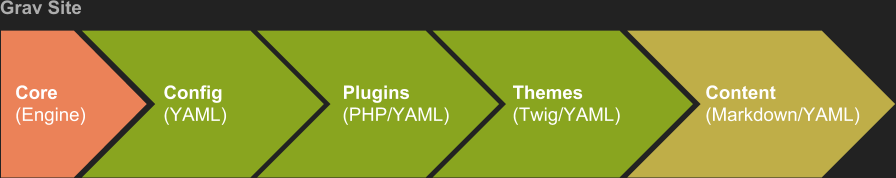

autoscale: true
footer: Paul D Hibbitts (@hibbittsdesign)
slidenumbers: true

[.header: color:, #FFFFFF, alignment(left)]
# Delivering a Better Experience by Using the Open, Collaborative and Flexible Grav CMS – Inside or Outside of your LMS

---

# Topics for Today
- What is Grav?
- Grav Open Course Hub Project
- Other Open-related Grav Projects
- Next Steps

---

[.background-color: #8fa33b]
[.header: color:, #FFFFFF, alignment(left)]
# What is Grav?

---

[.background-color: #000000]

---

[.background-color: #000000]

---

# Key Aspects of Grav
- File-based
 - Fast performance (esp. smaller sites), simplicity, portability and generally more secure
 - File-based content also naturally supports version control
 - Grav can also be a front-end for any collaborative Git repository

---

# Key Aspects of Grav
- Markdown
 - A platform-independent format perfect for writing and the 5Rs
- Modular
 - Modular content is possible, along with custom content types
- Workflow
 - Supports an efficient edit and publish workflow (esp. Git-based)
- Customization
 - Powerful Blueprints supports Admin Panel customizations

---

---

[.background-color: #8fa33b]
[.header: color:, #FFFFFF, alignment(left)]
# Open Course Hub Project

---

# Grav Open Course Hub
Built using Grav, Open Course Hub with Git Sync is designed to give tech-savvy educators an open, collaborative and flexible platform that they can partner with their current LMS

---

# Key Aspects of Grav Open Course Hub
- Streamlined setup and configuration (incl. Git Sync)
- Supports open and collaborative content (via Git repository)
- Theme files synced to Git repository for collaborative authoring/assistance
- 'Chromeless' mode for embedding into other systems (i.e. Canvas LMS, Moodle, etc.)
- Example course hubs (incl. basic, intermediate. and advanced)
- Includes custom content type pages and Shortcodes (i.e. Embed.ly Web page preview cards, H5P and Swipe)
- Fully customizable Sidebar using Markdown or HTML

---

[.background-color: #000000]

---

[.background-color: #000000]

---

[.background-color: #000000]

---

# What Skills are Required?
- Intended for 'Tech-savvy' educators:
 - Code editor usage (e.g. Atom or Brackets)
 - Markdown or HTML basics
 - Understanding folder hierarchies (i.e. relative links)
 - Web server access
 - GitHub working knowledge (recommended)

---

# Grav Open Course Hub is Intended for Tech-savvy Educators who Value:
- Controllability
- Flexibility
- Portability
- Efficiency
- Openness
- Participation

---

[.background-color: #FFFFFF]

---

[.background-color: #FFFFFF]

---

[.background-color: #FFFFFF]

---

[.background-color: #FFFFFF]

---

# Problems That Course Hub Addresses
- Pedagogical goals that are unmet by the current LMS
- Student and facilitator experiences, especially multi-device, are below expectations
- Ability to access, share and collaboratively edit course materials is lacking
- The creation and (often frequently needed) updating of online course materials is too time consuming
- Once created, online course materials are difficult to repurpose on different platforms for different contexts
- Unable to leverage existing Web authoring skills or standards on the current Learning Platform

---

# But What are Users Saying?
> The Open Course Hub was easy to set up and get running and my students loved having a one-stop place to go to for their course content. I really love that it syncs with GitHub so easily and seamlessly. I was able to have an open, collaborative, easily updatable, fully version-controlled site up and running in little time, with fairly modest technical skills. On the student side, it is all beautiful and easy to use on any device!
-- Mark Coster (Associate Professor at Griffith University, Australia)

---

# But What are Users Saying?
> The Open Course Hub project provides a series of excellent resources for integrating Grav with Canvas, as well as documentation and examples which make them a joy to work with. It is quick to set up, easy to use, and especially with the Git Sync plugin shows the power of a modern approach to integrated CMS-LMS solutions. The large and complex architecture of Canvas is complemented by the relative simplicity of Grav, and the Open Course Hub demonstrates this well.
-- Ole Vik (Research Assistant at the University of Bergen, Norway and Grav Plugin Developer)

---

[.header: color:, #FFFFFF, alignment(left)]
# Enough Talk, Demo Time!
## [demo.hibbittsdesign.org/coursehub](http://demo.hibbittsdesign.org/coursehub)

---

[.background-color: #8fa33b]
[.header: color:, #FFFFFF, alignment(left)]
# Other Open-related Grav Projects

---

[.background-color: #FFFFFF]

---

[.background-color: #FFFFFF]

---

[.background-color: #FFFFFF]

---

[.background-color: #8fa33b]
[.header: color:, #FFFFFF, alignment(left)]
# Next Steps

---

# Things to Explore Next
- Grav CMS Official Site
 - [getgrav.org](https://getgrav.org)
- Markdown
 - [Learn the basics of Markdown in ten minutes](https://designedbywaldo.com/en/tools/markdown-tutorial)
- GitHub Workflow
 - [Introduction - Git and GitHub for Poets](https://www.youtube.com/watch?v=BCQHnlnPusY&index=1&list=PLRqwX-V7Uu6ZF9C0YMKuns9sLDzK6zoiV)
 - [GitHub Desktop App](https://desktop.github.com/)

---

# Summary
- What is Grav?
- Grav Open Course Hub Project
- Other Open-related Grav Projects
- Next Steps

---

# Thank you. Q&A Time!

- Contact Info
  - Blog: hibbittsdesign.org
  - Twitter: @hibbittsdesign
  - Email: paul@hibbittsdesign.org
- Grav Open Course Hub
  - Demo: demo.hibbittsdesign.org/coursehub
  - Canvas Demo: demo.hibbittsdesign.org/canvascoursehub
  - Moodle Demo: demo.hibbittsdesign.org/moodlecoursehub
  - Docs: learn.hibbittsdesign.org/coursehub
